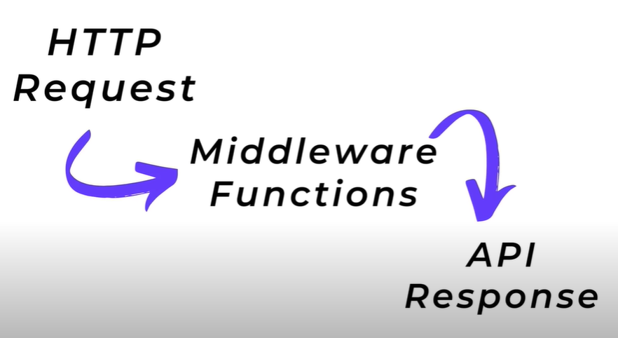

What is Middleware?
middleware is 1 or more funcations that run in between the HTTP Request and the API Response

Middleware can add addional functionality for the API
and preliminary request processing

Middleware Types:
. Built in
. Custom
. 3rd Party

express.static is a type of middleware and it is telling our server where to grab the public files
